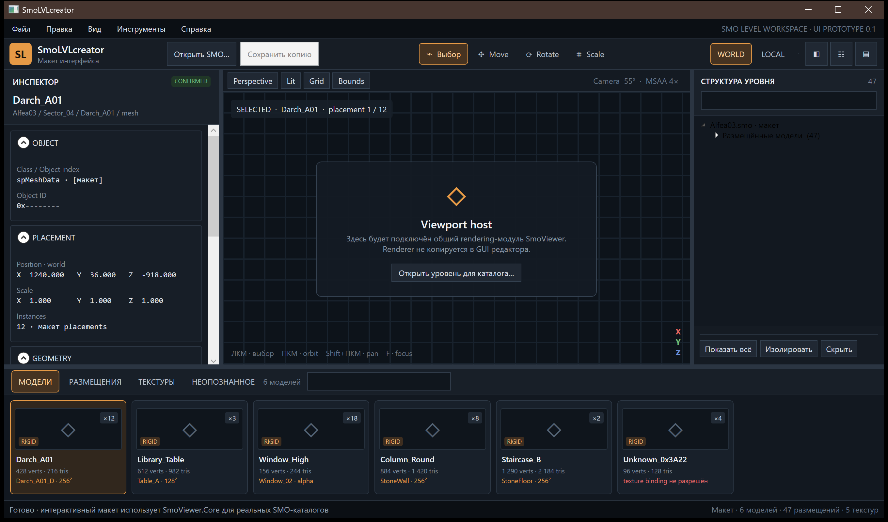

# SmoLVLcreator

SmoLVLcreator is the level-oriented editor shell for Sparkplug SMO scenes.

Текущая тестовая сборка — **0.1.1**, кандидат от 2026-09-08; опубликованная версия — **0.1.0**.
Сборка включает текущие общие исправления decoder и импортируемых ресурсов.
Минимальный план редактора
выполнен; известные ограничения и задачи после пользовательского тестирования
зафиксированы в [release notes](RELEASE_NOTES_0.1.1.md) и
[плане доработки](ROADMAP.md).



## Module boundary

- `SmoLVLcreator.Gui` owns editor layout and interaction only.
- `SmoLVLcreator.Core` projects shared SMO data into assets and placements.
- `SmoLevelDocument` groups mesh parts by scene object into editable level
  entities, then layers mutable transforms and branching
  Undo/Redo history over that read-only workspace without writing the source.
- `SmoLVLcreator.Viewport.Wpf` owns editor-only viewport overlays and gizmos.
  It builds on the shared renderer without adding editor behavior to SmoViewer.
- All binary parsing, mesh, texture, material, transform, and shared-instance
  knowledge remains in `SmoViewer.Core`.
- Direct SBOO fields, confirmed class/property schemas, typed value encoding,
  and the checked FFPS mutation transaction also live in `SmoViewer.Core`.
  SmoLVLcreator consumes only schema-backed transform and collision operations;
  arbitrary raw fields remain a format-research API rather than editor UI.
- The OpenGL backend, render input, and viewport math live in the shared
  `SmoViewer.Rendering.Wpf` project. Both Viewer and this GUI reference it.
- `SmoViewer.Scene` owns the authoritative decode-to-render mapping: materials,
  textures, alpha ordering, transforms, skins, and shared instances are prepared
  once for every host.
- The editor viewport adds only editor concerns around those modules: camera
  input, entity selection, selection highlighting, framing, transform gizmos,
  and its surrounding layout.
- `SmoImporter.Core` and `SmoExporter.Core` are referenced directly for model,
  texture and selection operations rather than reimplemented inside the editor.

## Run

```powershell
dotnet run --project tools/SmoLVLcreator/SmoLVLcreator.Gui/SmoLVLcreator.Gui.csproj
```

The startup screen is an empty workspace: it contains no fabricated scene,
catalog or inspector data and keeps editing commands disabled until a file is
opened. `Open SMO` fills it with the real catalog and renders the prepared scene
through the same OpenGL backend as SmoViewer. Left click selects the level entity
under the cursor and synchronizes
the catalog, outliner, inspector, and every mesh-part highlight belonging to it.
`Ctrl+left click` toggles entities in a multi-selection and `Esc` clears it.
Right mouse orbits,
Shift+right mouse pans, and `F` frames the active placement. With no focused placement,
right mouse becomes free-look around the camera position, the wheel moves
forward/back, and `WASD` plus `Q/E` provide free-flight movement. Selecting a
placement switches to orbit around its center; any flight key returns to free
mode. A `.smo` path may also be supplied as the first command-line argument.
The viewport toolbar switches Perspective/Orthographic projection,
Lit/Unlit/Wireframe rendering, the floor Grid and selection Bounds without
rebuilding the level or resetting the camera.

The bottom catalog has four live projections of the loaded workspace. `Models`
shows unique decoded meshes, `Placements` shows every individual scene instance
with its current coordinates, `Textures` shows every decodable `spTextureData`
resource and its confirmed model users, and `Unknown` combines unregistered
object classes with parser, mesh, and texture diagnostics. Search applies to the
active projection. Model and placement cards support standard extended selection
(`Ctrl`/`Shift`), update the viewport selection used by gizmos and export, and
double-click focuses the active placement. The context menu can focus or reveal
the active card in the outliner and invoke the shared selection export commands.
Models already in the SMO and newly imported rigid models use the same placement
path: drag a card onto the viewport or select it and press `Разместить`.
Visible model and placement cards lazily render cached thumbnails from the shared
`SmoSceneMesh`; texture cards display downsampled decoded BGRA pixels. Thumbnail
presentation lives in `SmoViewer.Rendering.Wpf`, so Viewer and future WPF tools
can reuse it without moving binary or scene knowledge into this GUI.
Untextured meshes retain their authored vertex-color palette in thumbnails. The
preview queue is replaced whenever the horizontal viewport changes, so the newly
visible cards preempt stale off-screen work; cache hits are applied immediately.

File operations live in the `File` menu rather than the viewport toolbar. It
contains Open, Save, Save As, quick Export, Export As, and Exit. `Edit` exposes
Undo/Redo, `View` controls the three editor panels, and `Tools > Settings…` opens
the persistent editor settings window.

Choose `Move` and drag the WORLD/LOCAL X/Y/Z gizmo to translate every selected
entity. Hold `Ctrl` while dragging to snap the delta to a one-unit grid. The X/Y/Z
fields in the inspector apply an exact position to the active entity and preserve
the relative offsets of the rest of the selection. A drag or numeric edit is one
atomic history entry; `Esc` cancels a live drag, while `Ctrl+Z`, `Ctrl+Y`, and
`Ctrl+Shift+Z` navigate the committed history.

`Rotate` draws local/world X/Y/Z rings and rotates the complete selection around
its common pivot. `Scale` provides local/world axis handles plus a center handle
for uniform scaling. Hold `Ctrl` for 15-degree rotation snapping or 0.1 scale
increments. Position, Euler rotation in degrees and non-uniform XYZ scale can
also be entered exactly in the inspector. Switching tool or transform space
cancels a live drag exactly. `Ctrl+C`, `Ctrl+V` and `Ctrl+D` copy, paste and
duplicate placements while reusing their physical mesh and texture resources.

The editor keeps visual placements and `spCollisionInfo` shapes as independent
entities, then creates non-destructive links for high-confidence geometric matches
inside the same `spPartitionNode`. `MOVE LINKED` is enabled by default, so a gizmo
drag or numeric position edit moves both sides in one undoable command. Disable it
to move the selected visual or collision independently. The inspector's `BINDINGS`
section shows the linked peer, object index, and match confidence.
Collision creation opens a preview with the visual source and proposed convex
hull, triangle budget and padding. Generated collision entities can be regenerated,
deleted, moved independently, or manually linked to a visual entity. Existing
native collision entities can also be deleted with the toolbar button or `Delete`;
saving removes their field-7 physics registry binding and the complete inline
`spCollisionInfo`/`spMeshBV` branch, while Undo restores the pending edit before
save.
The manual association controls editor behavior; persisted transforms and
geometry remain ordinary independent SMO collision objects.

`Save` or `Ctrl+S` stores the current `.smolvlproj`; an opened SMO is first
imported as an immutable project source. `File > Build SMO…` creates a separate
game file. Only confirmed transform, collision, resource and payload operations
from the project journal are applied. Sparkplug may omit identity rotation and
unit scale; those optional fields are materialized in their confirmed order when
needed. Unrelated and unknown fields remain byte-preserved. The result is parsed
again before installation, written through a same-directory temporary file and
checked by SHA-256 after installation. Replacing an existing output uses an
atomic replace and creates a timestamped `.bak` beside it.
Objects without a confirmed transform schema are rejected rather than written
heuristically. The binary contract is described in
[SMO field mutation subsystem](../../docs/formats/smo-field-mutation.md).

Every final SMO build creates `<output>.SmoLVLcreator.log` beside the requested
file. The project path records the snapshot, object/data counts, worker limit,
output hash, backup path, completion status and complete exception stack traces.
The error dialog always shows the expected log path.

Final building is a bounded sequential operation rather than an opaque UI task.
The status bar reports snapshot, load, journal verification, streaming build and
completion stages plus the current container size. `Отмена` terminates the owned
worker; a partially written same-directory temporary file is never installed.

The production SMO build runs in a separate invocation of the editor under a
Windows Job Object. The job limits both one process and the complete worker tree
to 1536 MiB. That value is an upper bound, not memory that must be available or
allocated. The GUI writes an exact `.smolvlproj` snapshot, so the worker never
needs the renderer scene and a failed worker cannot corrupt or inflate the live
document. Progress and the structured result are exchanged through atomic JSON
files. A physical-memory estimate may show a warning, but never prohibits the
user from continuing.

Large external models are packed one mesh part per short-lived child process.
Imported texture IDs are carried between parts, so a texture shared by thirty
meshes is embedded once rather than thirty times. Level texture payloads have a
128 MiB decoded-BGRA budget; oversized sets are proportionally resized while
preserving alpha and material bindings. The same prepared textures are shared by
all viewport and fitting-window preview meshes instead of being decoded once per
mesh. If any memory or timeout limit is exceeded, only the save job is stopped
and the target remains untouched.

The reproducible stress runner performs random transforms, shared and external
placements, complete composite replacements, texture edits and removals in a
separate process. It also exercises collision creation/transformation/deletion,
archive checkpoints and build/reopen/re-import determinism. It never writes the
source level, applies a managed-heap limit plus a parent-process private-memory
watchdog, and retains the resulting SMO, project and JSON metrics under
`artifacts/stress`:

```powershell
dotnet run --project `
  tools/SmoLVLcreator/SmoLVLcreator.CoreTests/SmoLVLcreator.CoreTests.csproj `
  -c Release -- `
  --stress-project-save `
  "local-data/Winx Club/Media/Levels/Alfea/Alfea02_old.smo" `
  "local-data/Модели" `
  250 260830
```

Optional arguments select an output root, the child private-memory limit in MiB
and the supervisor timeout in seconds. A fixed seed reproduces the same authoring
commands and makes a failing pipeline stage diagnosable from its JSON report.

The final 2026-08-29 regression with seed `82744` completed 1,000 mixed edits:
602 transforms, 238 shared placements, one external import, one complete model
replacement, 53 texture replacements, 67 removals and 38 collision operations.
Both archive checkpoints built and reopened successfully. The final
7,190,186-byte result contains 4,781 parsed objects; peak worker working set was
356.9 MiB and the final build took 17.1 seconds.
Repeated build and project re-import produced the same SHA-256
`2E95388BC62E29A29F7ADE974DF9C09EEE2AE12283E6185648FC59CB943B4884`.
That exact candidate was then accepted by the native game loader, reached
scene-ready level 28, passed a DirectInput movement/camera probe and completed
without a crash. A separate 31-part/13-texture 4K GLB regression produced a
134,376,352-byte level with all 729 meshes decodable and a 1,412.3 MiB aggregate
worker peak.

## Import and diagnostics

Model addition and complete replacement pass
through one `SmoLevelImportValidator` contract in both the GUI and
`SmoLVLcreator.Core`. It rejects malformed topology, inconsistent optional
channels, broken material/texture references, non-finite positions, skinned
level resources before editor history changes. Project-backed complete
replacement may change the number of parts because it adds a new resource graph
and removes the old scene branches instead of forcing bytes into old mesh slots.
Non-fatal decoder repairs and the MASK-to-engine-alpha compatibility decision are
shown for confirmation. Texture replacement explicitly asks whether to replace
RGB and alpha together or preserve the original SMO alpha.

The inspector's `RAW DATA` section is read-only and comes from the shared
`SmoObjectFieldReader`/`SmoSchemaRegistry`. It lists exact table, logical and
physical offsets, every direct field, a bounded hex preview and current values of
confirmed schema properties for the placement, resource or collision objects.
For recovered `spFog`, `spLightData`, navigation, BSP and particle-system
classes, the final (most-derived) serializer section also shows the confirmed
engine field name and payload layout. Sparkplug reuses field numbers in inherited
sections, so those earlier fields deliberately remain raw.
Unknown fields remain visible and byte-preserved without being assigned guessed
meaning. `Help > Управление и горячие клавиши…` summarizes camera, selection,
editing, catalog and file workflows inside the application.

## Project serializer

The editor-owned object graph and `.smolvlproj` archive are now the main
SmoLVLcreator workflow. Opening either an SMO or an existing project creates the
same project session; an opened SMO is an immutable source and is never
overwritten in place. `Ctrl+S` stores the project, while `File > Build SMO...`
creates a game file. A project archive stores normalized FFPS header/catalog
and direct-field metadata in `project.json`, plus the immutable known/unknown
data stream in `data.bin`; it contains no copied `base.smo`. New serialized
object forests live in separate immutable `assets/<guid>.bin` entries rather
than in JSON or a rewritten base stream. Property changes
are stored as stable-ID operations. Its copy-on-write layout planner can patch
existing transform slices and materialize absent optional fields while
recalculating nested payloads, inline sizes and catalog offsets. Zero-edit
projects still have to reproduce the exact source SHA-256. The separate CLI,
field-edit tests and confirmed real-level round trips are documented in
[SmoLVLcreator.ProjectTool](SmoLVLcreator.ProjectTool/README.md).

The Tools menu can validate the exact current project build in the game through
the shared contextual validator. The core also exposes the first
importer-facing structural primitive: reserve stable IDs, attach an opaque
inline forest at a confirmed owner boundary, then regenerate the complete FFPS
catalog and all owning sizes in one streaming build.

Generated collisions and complete rigid external models now use that primitive.
`+ Model...` imports and places the first instance at the camera
target; mesh parts, shared materials, textures and alpha state are retained as
separate immutable project assets and enter the output stream only when preview
or SMO output is built. One isolated worker serializes the complete model and
returns only new forest plans, blobs and catalog metadata to the editor; no
rolling full SMO is written to disk. The strict additive adapter rejects a serializer
result if it changes, moves or removes an imported object instead of adding
complete inline forests.
The resulting mesh cards support the same `Place` button and viewport
drag-and-drop as original level resources. Additional instances contain only a
new static placement shell and reference the asset mesh; they do not duplicate
geometry, materials or textures. The first asset-owning placement is editable
too: its world/inverse matrices are stored as project overlays over the
immutable asset blob and applied only during preview or final build.

Reference shells are resource-specific. An imported mesh with a physical
`spStaticRenderObject` derives the lightweight copy from its own branch and
replaces only the copied inline geometry with a backward reference; a resource
that is already shared reuses an existing shell for that exact resource. The
definition is emitted before every new reference and both remain in the same
confirmed owner/partition. If the original physical placement is removed while
generated placements still use its mesh, the first surviving generated
placement deterministically becomes the new physical owner and later placements
remain references. References are selected by exact field type and occurrence,
so duplicate mesh-reference fields inside one shell are never conflated. Baked
sector geometry under
`spPartitionRenderable` has no independent placement transform and is therefore
not offered as a safe reference placement; moving it requires a future explicit
vertex-copy/rebase operation instead of borrowing an unrelated object's shell.

Manual visual-to-collision association overrides are editor metadata stored in
the `.smolvlproj` manifest. They survive reopen, participate in the same project
Undo/Redo history, follow promoted project object IDs and are pruned when either
side is deleted. They intentionally do not create an unconfirmed engine field in
the final SMO; collision geometry and transforms remain independent serialized
objects.

Catalog `Replace...` is project-backed as well. The fit window produces one
reference transform; every old instance keeps its transform relative to that
reference. The importer then emits a complete new mesh/material/texture graph
for all instances, including alpha state, and the project removes all old scene
branches as one reachability transaction. Shared descendants still used
elsewhere are relocated before pruning. The core also has a generic stable-ID
resource redirect operation: it patches imported fields, added asset blobs and
generated placement shells uniformly, and omits the unreachable old inline
resource only during SMO build. Both replacement forms participate in Undo/Redo
and leave `data.bin` immutable.

## Selection export

Select one or more complete visual entities in the viewport with `Ctrl+left
click`. Export always writes the complete selection to one scene, including all
mesh parts and their current editor transforms; the level does not have to be
saved first. Collision-only selections are not silently converted to render
geometry.

- `File > Export` (`Ctrl+E`) uses the configured directory and format without a
  dialog. The stable file name is derived from the level and selection.
- `File > Export As…` (`Ctrl+Shift+E`) opens the standard Windows save dialog.
  Its file-type list selects GLB, FBX, or OBJ directly.
- `Tools > Settings…` configures the quick-export directory and format. Settings
  are stored in
  `%LOCALAPPDATA%/SparkplugEngineResearch/SmoLVLcreator/settings.json`.

The GUI supplies selection and dialogs only. `SmoLevelExportService` adapts the
mutable editor document to the shared `SmoExporter.Core`; GLB, FBX, OBJ, material,
texture, coordinate-system, and instancing behavior are not reimplemented in the
level editor. FBX requires the shared `SmoFbxBridge.exe`; GLB and OBJ are managed
export paths. OBJ cannot preserve varying per-vertex alpha; use GLB or FBX for
such a selection.

## Release package

Пользовательский архив собирается общей системой репозитория:

```powershell
powershell.exe -NoProfile -ExecutionPolicy Bypass `
  -File ./release/Build-Releases.ps1 -Product SmoLVLcreator
```

Результат помещается в `artifacts/release/current` и содержит стабильную точку
запуска `SmoLVLcreator.exe`, single-file приложение, документацию и общий native
FBX runtime. Для запуска требуется Windows 10/11 x64; bootstrapper при
необходимости предлагает установить официальный .NET 8 Desktop Runtime x64.
